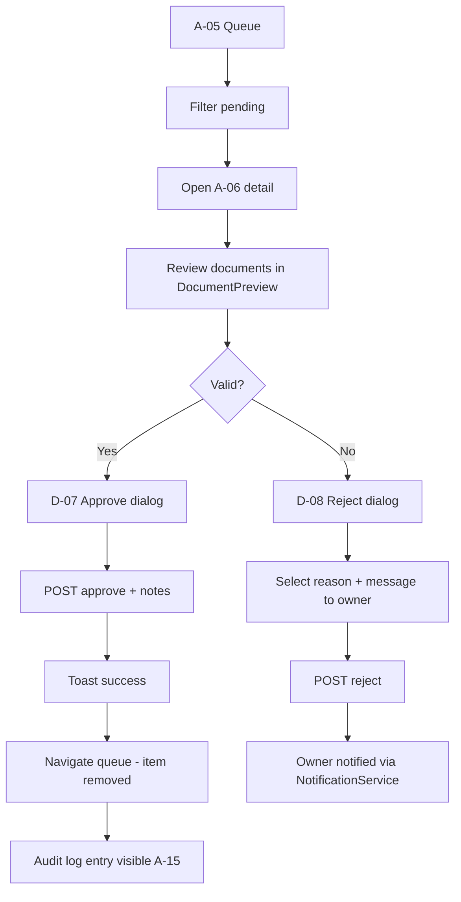
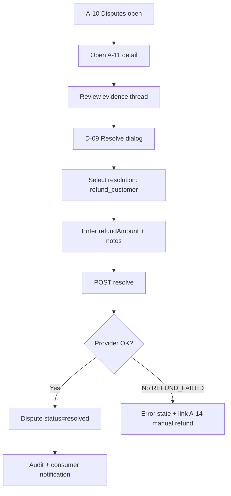

# Rezerva Admin Panel — UI Design Specification

**Version:** 1.0  
**Milestone:** M10 — Admin + Trust Operations  
**Status:** Design only (no implementation)  
**Audience:** Frontend engineers, product, QA

---

## Document sources

This specification is derived from:

| Source                | Location                                             | Role                          |
| --------------------- | ---------------------------------------------------- | ----------------------------- |
| Product requirements  | `.github/issues/issues.json` (M10 epic)              | Scope, acceptance criteria    |
| API contract          | `docs/API.md` §10 Admin                              | Endpoints, payloads, errors   |
| Frontend architecture | `docs/FRONTEND_ARCHITECTURE.md`                      | Route groups, feature layout  |
| Component inventory   | `docs/COMPONENTS.md`                                 | Shared primitives, dialog IDs |
| Backend architecture  | `docs/BACKEND_ARCHITECTURE.md`                       | Guards, audit, services       |
| UI system             | `.cursor/rules/ui.mdc`                               | Visual language               |
| Engineering rules     | `.cursor/rules/{frontend,architecture,security}.mdc` | Patterns, auth, validation    |

> There is no standalone `PRD.md` — M10 acceptance criteria in `issues.json` serve as PRD until a formal doc is authored.

---

## 1. Product intent

### 1.1 Purpose

The **Admin Panel** is the internal **Trust & Operations** surface for Rezerva platform staff. It enables:

- Business verification within **48-hour SLA**
- Dispute investigation and resolution with optional refund override
- Booking intervention (force cancel) for fraud and policy violations
- Review moderation (spam, abuse)
- Featured listing and commission configuration
- Platform settings (hold TTL, limits)
- Full **audit trail** — 100% of admin mutations logged with actor, IP, old/new values

### 1.2 Personas

| Persona            | Goals                                                  | Primary screens        |
| ------------------ | ------------------------------------------------------ | ---------------------- |
| **Verifier**       | Process onboarding queue, approve/reject documents     | A-05, A-06             |
| **Trust & Safety** | Resolve disputes, moderate reviews, suspend businesses | A-10, A-11, A-07, A-06 |
| **Operations**     | Search bookings, force cancel, manual refunds          | A-08, A-09, A-14       |
| **Growth / Ops**   | Manage featured listings, commission rates             | A-12, A-13             |
| **Platform Admin** | Overview KPIs, audit search, settings                  | A-02, A-15, A-16       |

### 1.3 Non-goals (M10)

- Business owner dashboard (see `(business)` route group)
- Consumer booking flows
- Telegram bot administration
- Multi-region analytics (M11)
- Separate `apps/admin` deploy — use `(admin)` route group in existing Next.js app

### 1.4 Design principles

- **Desktop-first** — sidebar + data-dense tables; responsive collapse to sheet nav on tablet
- **Apple-inspired minimalism** — Inter font, 8px grid, rounded-xl, primary `#2563EB`, neutral grays, dark-mode ready
- **Action clarity** — destructive actions require confirmation + reason field
- **Audit by default** — every mutation shows post-action toast with “View in audit log” link
- **No business logic in UI** — components call `features/admin/api/*`; validation via Zod + shared DTO shapes

---

## 2. Sitemap

```
/admin
├── /                          → A-02 Overview (dashboard)
├── /verifications             → A-05 Verification queue
│   └── /[verificationId]      → A-06 Verification detail
├── /bookings                  → A-08 Bookings explorer
│   └── /[bookingId]           → A-09 Booking detail (admin)
├── /disputes                  → A-10 Disputes queue
│   └── /[disputeId]           → A-11 Dispute detail
├── /reviews                   → A-07 Flagged reviews
├── /businesses                → A-03 Businesses registry
│   └── /[businessId]          → A-04 Business detail (suspend/reinstate)
├── /featured                  → A-12 Featured listings manager
├── /commission                → A-13 Commission rates
├── /settings                  → A-16 Platform settings
├── /payments                  → A-14 Manual refunds (search + action)
├── /audit                     → A-15 Audit log explorer
└── /403                       → A-01 Access denied (non-admin)
```

### 2.1 Auth entry (outside admin sitemap)

| Route      | Screen      | Notes                                                   |
| ---------- | ----------- | ------------------------------------------------------- |
| `/login`   | Shared C-50 | Admin uses same OTP login; JWT must carry `role: admin` |
| `/admin/*` | —           | Middleware redirects non-admin to `/admin/403`          |

### 2.2 URL conventions

- Plural resource nouns: `/verifications`, `/bookings`
- Detail routes use UUID: `/verifications/:verificationId`
- Query state for filters (shareable): `?status=pending&page=2`
- No modal-only routes for primary detail — detail is a page; dialogs for mutations only

---

## 3. Navigation

### 3.1 Primary navigation — `AdminSidebar`

**Path:** `features/admin/components/admin-sidebar.tsx`  
**Layout slot:** Fixed left, 256px expanded · 64px icon rail collapsed

| Order | Label (uz) | Label (ru)   | Label (en)    | Route                  | Icon (Lucide)          | Badge                        |
| ----- | ---------- | ------------ | ------------- | ---------------------- | ---------------------- | ---------------------------- |
| 1     | Boshqaruv  | Обзор        | Overview      | `/admin`               | `LayoutDashboard`      | —                            |
| 2     | Tasdiqlash | Верификация  | Verifications | `/admin/verifications` | `ShieldCheck`          | `pendingVerifications` count |
| 3     | Bronlar    | Бронирования | Bookings      | `/admin/bookings`      | `CalendarDays`         | —                            |
| 4     | Nizolar    | Споры        | Disputes      | `/admin/disputes`      | `Scale`                | `openDisputes` count         |
| 5     | Sharhlar   | Отзывы       | Reviews       | `/admin/reviews`       | `MessageSquareWarning` | flagged count                |
| 6     | Bizneslar  | Бизнесы      | Businesses    | `/admin/businesses`    | `Building2`            | —                            |
| 7     | Tanlangan  | Избранное    | Featured      | `/admin/featured`      | `Star`                 | —                            |
| 8     | Komissiya  | Комиссия     | Commission    | `/admin/commission`    | `Percent`              | —                            |
| 9     | To'lovlar  | Платежи      | Payments      | `/admin/payments`      | `CreditCard`           | —                            |
| 10    | Sozlamalar | Настройки    | Settings      | `/admin/settings`      | `Settings`             | —                            |
| 11    | Audit      | Аудит        | Audit log     | `/admin/audit`         | `ScrollText`           | —                            |

**Behavior:**

- Active item: primary background tint + left 3px primary border
- Badge counts fetched from `GET /admin/overview` (cached 60s, invalidated on queue mutations)
- Collapse toggle persists in `localStorage` key `rezerva_admin_sidebar_collapsed`
- `< md`: sidebar becomes `Sheet` triggered from `AdminTopBar` hamburger

### 3.2 Top bar — `AdminTopBar`

**Path:** `features/admin/components/admin-top-bar.tsx`

| Zone   | Content                                                                                               |
| ------ | ----------------------------------------------------------------------------------------------------- |
| Left   | Hamburger (mobile) · Breadcrumbs                                                                      |
| Center | Global search (optional M10.1) — searches bookings by `referenceCode`                                 |
| Right  | Locale switcher · Admin user menu (name, email, logout) · Environment pill (`Production` / `Staging`) |

### 3.3 Breadcrumbs

**Path:** `shared/components/navigation/breadcrumbs.tsx`

Examples:

- `Boshqaruv`
- `Tasdiqlash` → `Football Arena Tashkent`
- `Nizolar` → `#DSP-1042`
- `Audit` → `business` → `biz-uuid`

### 3.4 Secondary navigation (in-page tabs)

Used on detail pages where multiple facets exist:

| Page                     | Tabs                                                  |
| ------------------------ | ----------------------------------------------------- |
| A-06 Verification detail | `Hujjatlar` · `Biznes ma'lumoti` · `Tarix`            |
| A-11 Dispute detail      | `Xulosa` · `Dalillar` · `To'lov` · `Audit`            |
| A-04 Business detail     | `Profil` · `Bronlar` · `Verifikatsiya` · `Harakatlar` |

---

## 4. Layout

### 4.1 Layout hierarchy

```
app/layout.tsx                          # Root providers (Query, Auth, Theme, i18n)
└── app/(admin)/layout.tsx              # AdminLayout
    ├── AdminSidebar
    ├── AdminTopBar
    ├── main (scroll container)
    │   ├── PageHeader (title + actions)
    │   └── {children}
    └── Toaster
```

### 4.2 `AdminLayout` specification

**File:** `frontend/src/app/(admin)/layout.tsx`  
**Type:** Server Component shell + client sidebar interactivity

| Property          | Value                                                                  |
| ----------------- | ---------------------------------------------------------------------- |
| Min width         | 1024px recommended; usable at 768px with sheet nav                     |
| Background        | `bg-background`                                                        |
| Content max-width | `max-w-screen-2xl` centered with `px-6 py-8`                           |
| Auth guard        | Server `requireAdmin()` — redirect to `/admin/403` if `role !== admin` |

### 4.3 Page shell — `AdminPageShell`

**Path:** `features/admin/components/admin-page-shell.tsx`

```tsx
// Conceptual structure (not implementation)
<AdminPageShell
  title="Tasdiqlash navbati"
  description="48 soat ichida ko'rib chiqish talab qilinadi"
  breadcrumbs={[...]}
  actions={<FilterBar />}
>
  {children}
</AdminPageShell>
```

| Slot          | Purpose                                      |
| ------------- | -------------------------------------------- |
| `title`       | H1 — `text-2xl font-semibold tracking-tight` |
| `description` | Muted subtitle                               |
| `breadcrumbs` | Desktop only                                 |
| `actions`     | Primary buttons, export, filter toggle       |
| `children`    | Page body                                    |

### 4.4 Grid patterns

| Pattern              | Use                                 |
| -------------------- | ----------------------------------- |
| 4-col stat grid      | A-02 overview KPIs                  |
| 12-col master-detail | A-05 queue + preview pane (≥1280px) |
| Full-width table     | Lists: bookings, disputes, audit    |
| 2-col form           | Settings, commission create         |

### 4.5 Visual tokens (admin-specific)

| Token   | Value                            | Usage                                 |
| ------- | -------------------------------- | ------------------------------------- |
| Primary | `#2563EB`                        | CTAs, active nav, links               |
| Success | `#16A34A`                        | Approved, resolved                    |
| Warning | `#D97706`                        | SLA breach approaching, investigating |
| Danger  | `#DC2626`                        | Reject, suspend, force cancel         |
| Surface | `card` + `border-border`         | Tables, detail panels                 |
| Radius  | `rounded-xl` (12px)              | Cards, dialogs                        |
| Spacing | 8px base (`gap-2`, `p-4`, `p-6`) | All layouts                           |

---

## 5. Pages

### Screen registry

| ID   | Route                       | Name                | API primary                         |
| ---- | --------------------------- | ------------------- | ----------------------------------- |
| A-01 | `/admin/403`                | Access denied       | —                                   |
| A-02 | `/admin`                    | Overview dashboard  | `GET /admin/overview`               |
| A-03 | `/admin/businesses`         | Businesses registry | Derived from verifications + search |
| A-04 | `/admin/businesses/[id]`    | Business detail     | `POST suspend/reinstate`            |
| A-05 | `/admin/verifications`      | Verification queue  | `GET /admin/verifications`          |
| A-06 | `/admin/verifications/[id]` | Verification detail | `GET/POST approve/reject`           |
| A-07 | `/admin/reviews`            | Flagged reviews     | `GET /admin/reviews/flagged`        |
| A-08 | `/admin/bookings`           | Bookings explorer   | `GET /admin/bookings`               |
| A-09 | `/admin/bookings/[id]`      | Booking detail      | `POST .../cancel`                   |
| A-10 | `/admin/disputes`           | Disputes queue      | `GET /admin/disputes`               |
| A-11 | `/admin/disputes/[id]`      | Dispute detail      | `GET/POST resolve`                  |
| A-12 | `/admin/featured`           | Featured listings   | CRUD `/admin/featured-listings`     |
| A-13 | `/admin/commission`         | Commission rates    | `GET/POST /admin/commission-rates`  |
| A-14 | `/admin/payments`           | Manual refunds      | `POST /admin/payments/:id/refund`   |
| A-15 | `/admin/audit`              | Audit log           | `GET /admin/audit-logs`             |
| A-16 | `/admin/settings`           | Platform settings   | `GET/PUT /admin/settings/:key`      |

---

### A-01 — Access denied

**Purpose:** Shown when authenticated user lacks `admin` role.

| Element | Content                                               |
| ------- | ----------------------------------------------------- |
| Icon    | `ShieldOff` muted                                     |
| Title   | Kirish taqiqlangan                                    |
| Body    | Ushbu bo'lim faqat platforma administratorlari uchun. |
| Actions | `Bosh sahifaga qaytish` · `Chiqish`                   |

No sidebar rendered. HTTP semantic: page renders 403 content; middleware already blocked route.

---

### A-02 — Overview dashboard

**Purpose:** Operational pulse — queue pressure, GMV, growth.

**Layout:** 4 KPI stat cards → 2-col charts row → 3 quick-action cards

**Sections:**

1. **KPI row** (see §10 Dashboard Widgets)
2. **Queues at a glance** — mini tables: top 5 pending verifications, open disputes
3. **Quick actions** — links with counts: `Tasdiqlash (12)` · `Nizolar (3)` · `Audit bugun`

**Actions:** Refresh (revalidate) · Date range toggle (today / 7d) — future

**Empty:** N/A (zeros displayed as `0`, not empty state)

---

### A-05 — Verification queue

**Purpose:** SLA-driven queue for business onboarding approval.

**Filters (query params):**

| Filter     | Values                                         |
| ---------- | ---------------------------------------------- |
| `status`   | `pending` (default) · `approved` · `rejected`  |
| `category` | football · salon · restaurant · clinic · hotel |
| `sort`     | `submittedAt:asc` (SLA) · `submittedAt:desc`   |

**Table columns:**

| Column    | Content                                                            |
| --------- | ------------------------------------------------------------------ |
| Business  | Name + category badge                                              |
| Submitted | Relative time + SLA indicator (green <24h, amber 24–48h, red >48h) |
| Documents | Count + types icons                                                |
| Submitter | Phone / email                                                      |
| Actions   | `Ko'rish` → A-06                                                   |

**Master-detail (≥1280px):** Selecting row opens preview pane without navigation; `Enter` navigates to A-06.

**Row click:** Navigate to `/admin/verifications/[id]`

---

### A-06 — Verification detail

**Purpose:** Document review and approve/reject decision.

**Layout:** 2-col — left document viewer (60%) · right decision panel (40%)

**Left — `DocumentPreview`:**

- PDF/image viewer with zoom, rotate, page nav
- Thumbnail strip for multiple documents (license, passport, venue photos)
- Document type labels from `VerificationDocumentType`

**Right — Decision panel:**

| Field                | Source                          |
| -------------------- | ------------------------------- |
| Business summary     | Name, category, address, tax ID |
| Onboarding checklist | Steps completed                 |
| Submitter            | User link                       |
| Previous submissions | If re-submitted after reject    |

**Sticky footer actions:**

- `Rad etish` → opens **D-08**
- `Tasdiqlash` → opens **D-07**

**Audit link:** After action, inline banner “Audit yozuvi yaratildi” → filter audit by entity

---

### A-08 — Bookings explorer

**Purpose:** Platform-wide booking search and intervention.

**Filters:**

| Param           | UI control             |
| --------------- | ---------------------- |
| `referenceCode` | Search input (primary) |
| `businessId`    | Async combobox         |
| `userId`        | Phone search           |
| `status`        | Multi-select chips     |
| `from` / `to`   | Date range picker      |

**Table columns:** Reference · Business · Consumer · Service · Slot · Status · Amount · Created · Actions

**Actions per row:** `Ko'rish` → A-09 · `Bekor qilish` (danger, opens cancel dialog)

---

### A-09 — Booking detail (admin)

**Purpose:** Full booking context for support and force cancel.

**Sections:**

1. **Header** — Reference code (copy) · Status badge · Amount
2. **Timeline** — hold → confirm → payment → completion events
3. **Parties** — consumer, business, location
4. **Payment block** — provider, transaction ID, refund status
5. **Policy snapshot** — JSON viewer (collapsed)
6. **Related** — linked dispute if any

**Primary action:** `Majburiy bekor qilish` → **D-10** `ForceCancelBookingDialog`

**D-10 fields:** `reason` (select) · `refundOverride` (none/partial/full) · `notes` (internal)

---

### A-10 — Disputes queue

**Filters:** `status=open|investigating|resolved`

**Table columns:** ID · Booking ref · Amount · Opened · Status · Assignee (future) · SLA · Actions

**Status colors:** open=warning · investigating=primary · resolved=success

---

### A-11 — Dispute detail

**Layout:** 3-col on desktop — summary | evidence thread | side panel (payment + actions)

**Evidence thread:** Chronological messages from consumer, business, system

**Side panel:**

- Booking summary card
- Payment status + refund history
- Linked review if applicable

**Primary action:** `Nizoni hal qilish` → **D-09**

**Secondary:** `Qaytarishni alohida amalga oshirish` → links to A-14 with payment pre-filled

---

### A-07 — Flagged reviews

**Purpose:** Moderate reported/spam reviews.

**Table:** Business · Rating · Excerpt · Report reason · Reporter · Date · Actions

**Row actions:** `Yashirish` · `Tasdiqlash` · `O'chirish` — each opens **D-11** `ModerateReviewDialog` with `action` + `reason`

---

### A-03 / A-04 — Businesses registry & detail

**A-03 table:** Name · Category · City · Status · Verified · Actions

**A-04 detail tabs:**

- Profile (public-facing data)
- Bookings (embedded list, link to A-08 filtered)
- Verification history
- **Actions card:** `To'xtatish` → **D-12** · `Qayta faollashtirish` → **D-13**

---

### A-12 — Featured listings manager

**Layout:** Calendar timeline (optional M10.1) + table of active/scheduled

**Table columns:** Business · City · Category · Starts · Ends · Sort order · Status · Actions

**Actions:** `Tahrirlash` (sheet form) · `O'chirish` (confirm)

**Create form (sheet):** businessId · cityId · category · startsAt · endsAt · sortOrder

**Validation:** `endsAt > startsAt` · no overlapping sortOrder per city+category (server enforced)

---

### A-13 — Commission rates

**Layout:** Category table + “Add rate” form

**Table columns:** Category · Rate % · Effective from · Created · Status (active/future)

**Info banner:** “Yangi stavka faqat effectiveFrom sanasidan keyin yaratilgan bronlarga qo'llanadi.”

**Create form:** category select · ratePercent (0–30) · effectiveFrom date

---

### A-16 — Platform settings

**Layout:** Key-value table with inline edit

**Known keys (from API):**

| Key                         | Label (uz)                | Control      |
| --------------------------- | ------------------------- | ------------ |
| `hold_ttl_minutes`          | Hold vaqti (daqiqa)       | Number input |
| `max_active_holds_per_user` | Foydalanuvchi hold limiti | Number input |

**Edit pattern:** Row → `Edit` → inline input → `Save` → `PUT /admin/settings/:key`

**Confirm:** Unsaved row triggers **D-12** leave guard if navigating away

---

### A-14 — Manual refunds

**Purpose:** Admin-initiated refund outside dispute flow.

**Layout:** Payment search → detail card → refund form

**Search by:** payment ID · booking reference · provider transaction ID

**Refund form fields:** amount · reason (enum) · notes

**States:** Success toast · `REFUND_FAILED` → error with retry + audit link

---

### A-15 — Audit log explorer

**Purpose:** Forensics — searchable immutable log.

**Filters:**

| Param         | Control                                                           |
| ------------- | ----------------------------------------------------------------- |
| `entityType`  | Select: business, booking, verification, dispute, payment, review |
| `entityId`    | UUID input                                                        |
| `actorId`     | Admin user select                                                 |
| `action`      | Autocomplete from known actions                                   |
| `from` / `to` | Date range                                                        |

**Table columns:** Timestamp · Actor · Action · Entity · Summary · IP · Expand

**Expand row:** JSON diff viewer `oldValues` → `newValues` (syntax highlighted)

**Export:** CSV download (client-side from current page) — future

**Pagination:** Default limit 50, max 100

---

## 6. Components

### 6.1 Feature components (`features/admin/components/`)

| Component                 | Type                    | Used on    | Responsibility               |
| ------------------------- | ----------------------- | ---------- | ---------------------------- |
| `AdminSidebar`            | Client                  | Layout     | Primary nav, badges          |
| `AdminTopBar`             | Client                  | Layout     | Breadcrumbs, user menu       |
| `AdminPageShell`          | Server                  | All pages  | Title, actions slot          |
| `AdminOverview`           | Server + Client widgets | A-02       | KPI grid composition         |
| `VerificationQueue`       | Client                  | A-05       | Table, filters, SLA badges   |
| `VerificationPreviewPane` | Client                  | A-05       | Master-detail preview        |
| `VerificationDetail`      | Server                  | A-06       | Detail page layout           |
| `DocumentPreview`         | Client                  | A-06       | PDF/image viewer             |
| `DecisionPanel`           | Client                  | A-06       | Approve/reject actions       |
| `BookingsTable`           | Client                  | A-08       | Filterable data table        |
| `BookingAdminDetail`      | Server                  | A-09       | Booking context layout       |
| `DisputesTable`           | Client                  | A-10       | Queue table                  |
| `DisputeDetail`           | Server                  | A-11       | Evidence + resolution        |
| `EvidenceThread`          | Client                  | A-11       | Message timeline             |
| `FlaggedReviewsTable`     | Client                  | A-07       | Review moderation list       |
| `BusinessesTable`         | Client                  | A-03       | Business registry            |
| `BusinessAdminDetail`     | Server                  | A-04       | Suspend/reinstate            |
| `FeaturedManager`         | Client                  | A-12       | CRUD table + form sheet      |
| `CommissionRatesTable`    | Client                  | A-13       | Rates + create form          |
| `PlatformSettingsTable`   | Client                  | A-16       | Inline key-value edit        |
| `PaymentRefundSearch`     | Client                  | A-14       | Search + refund form         |
| `AuditLogTable`           | Client                  | A-15       | Filterable audit table       |
| `AuditDiffViewer`         | Client                  | A-15       | old/new JSON diff            |
| `SlaBadge`                | Server                  | A-05       | Color-coded SLA indicator    |
| `StatusBadge`             | Server                  | All        | Maps enums to badge variants |
| `AdminFilterBar`          | Client                  | List pages | Shared filter row            |
| `AdminDataTable`          | Client                  | List pages | TanStack Table wrapper       |

### 6.2 Dialogs (`features/admin/components/dialogs/`)

| ID   | Component                   | Trigger             | API                                |
| ---- | --------------------------- | ------------------- | ---------------------------------- |
| D-07 | `ApproveVerificationDialog` | A-06 Tasdiqlash     | `POST .../approve`                 |
| D-08 | `RejectVerificationDialog`  | A-06 Rad etish      | `POST .../reject`                  |
| D-09 | `ResolveDisputeDialog`      | A-11 Hal qilish     | `POST .../resolve`                 |
| D-10 | `ForceCancelBookingDialog`  | A-09 Majburiy bekor | `POST .../cancel`                  |
| D-11 | `ModerateReviewDialog`      | A-07 Moderate       | `POST .../moderate`                |
| D-12 | `SuspendBusinessDialog`     | A-04 To'xtatish     | `POST .../suspend`                 |
| D-13 | `ReinstateBusinessDialog`   | A-04 Faollashtirish | `POST .../reinstate`               |
| D-14 | `ManualRefundDialog`        | A-14 Qaytarish      | `POST .../refund`                  |
| D-15 | `DeleteFeaturedDialog`      | A-12 O'chirish      | `DELETE .../featured-listings/:id` |

**Dialog rules:**

- Destructive actions use `AlertDialog` (no click-outside dismiss)
- `reason` / `message` fields required on reject, suspend, cancel
- Submit button shows spinner; disabled until valid
- Success → toast + invalidate queries + optional navigate back to queue

### 6.3 Shared components (reused)

| Component                                                          | Path                                           | Admin usage       |
| ------------------------------------------------------------------ | ---------------------------------------------- | ----------------- |
| `StatCard`                                                         | `features/business/components/stat-card.tsx`   | A-02 KPIs         |
| `PageHeader`                                                       | `shared/components/layout/page-header.tsx`     | All pages         |
| `Breadcrumbs`                                                      | `shared/components/navigation/breadcrumbs.tsx` | AdminTopBar       |
| `EmptyState`                                                       | `shared/components/feedback/empty-state.tsx`   | Zero-result lists |
| `ErrorState`                                                       | `shared/components/feedback/error-state.tsx`   | API failures      |
| `Skeleton`                                                         | `shared/components/ui/skeleton.tsx`            | Loading tables    |
| `DataTable`                                                        | `shared/components/ui/data-table.tsx`          | All list pages    |
| `Badge`, `Button`, `Dialog`, `Sheet`, `Form`, `Select`, `Calendar` | shadcn/ui                                      | Throughout        |

### 6.4 Hooks (`features/admin/hooks/`)

| Hook                    | Returns                   | Used by              |
| ----------------------- | ------------------------- | -------------------- |
| `useAdminOverview`      | KPI data, refetch         | A-02, sidebar badges |
| `useVerifications`      | list, filters, pagination | A-05                 |
| `useVerificationDetail` | detail, approve, reject   | A-06                 |
| `useAdminBookings`      | list, filters             | A-08                 |
| `useAdminBookingDetail` | detail, forceCancel       | A-09                 |
| `useDisputes`           | list                      | A-10                 |
| `useDisputeDetail`      | detail, resolve           | A-11                 |
| `useFlaggedReviews`     | list, moderate            | A-07                 |
| `useFeaturedListings`   | CRUD                      | A-12                 |
| `useCommissionRates`    | list, create              | A-13                 |
| `usePlatformSettings`   | list, update              | A-16                 |
| `useAuditLogs`          | search, pagination        | A-15                 |
| `useAdminRefund`        | search payment, refund    | A-14                 |

### 6.5 API layer (`features/admin/api/`)

Thin wrappers over `shared/lib/api-client.ts`:

- `admin-overview.api.ts`
- `admin-verification.api.ts`
- `admin-booking.api.ts`
- `admin-dispute.api.ts`
- `admin-review.api.ts`
- `admin-featured.api.ts`
- `admin-commission.api.ts`
- `admin-settings.api.ts`
- `admin-audit.api.ts`
- `admin-payment.api.ts`
- `admin-business.api.ts`

All requests include `Authorization: Bearer` and `Accept-Language`.

---

## 7. Permissions

### 7.1 Role model

| Role                                 | Admin panel access  |
| ------------------------------------ | ------------------- |
| `consumer`                           | ❌ → A-01           |
| `owner` / `manager` / `receptionist` | ❌ → A-01           |
| `admin`                              | ✅ Full M10 surface |

M10 does **not** introduce sub-roles (e.g. verifier-only). All admins see all nav items. Sub-roles are a post-M10 consideration.

### 7.2 Enforcement layers

| Layer                 | Mechanism                                                     |
| --------------------- | ------------------------------------------------------------- |
| Edge                  | `middleware.ts` — JWT decode, `role === admin` for `/admin/*` |
| Server layout         | `requireAdmin()` in `(admin)/layout.tsx`                      |
| Server pages          | `requireAdmin()` on sensitive data loaders                    |
| API                   | `AdminGuard` on all `/v1/admin/*` — 403 `FORBIDDEN`           |
| Production (optional) | IP allowlist middleware on backend                            |

### 7.3 Client-side UX for 403

- Non-admin hitting `/admin/*` → redirect `/admin/403`
- Admin session expired → redirect `/login?returnUrl=/admin`
- API 403 during mutation → toast “Ruxsat yo'q” + logout suggestion

### 7.4 Action-level rules

| Action               | Preconditions                           | Audit action key          |
| -------------------- | --------------------------------------- | ------------------------- |
| Approve verification | status=pending                          | `verification.approve`    |
| Reject verification  | status=pending; reason+message required | `verification.reject`     |
| Force cancel booking | booking not terminal                    | `booking.force_cancel`    |
| Resolve dispute      | status=open or investigating            | `dispute.resolve`         |
| Moderate review      | review flagged                          | `review.moderate`         |
| Suspend business     | status=active                           | `business.suspend`        |
| Reinstate business   | status=suspended                        | `business.reinstate`      |
| Manual refund        | payment captured                        | `payment.refund_override` |
| Update setting       | valid key in allowlist                  | `settings.update`         |
| CRUD featured        | business active                         | `featured.*`              |
| Create commission    | effectiveFrom ≥ today                   | `commission.create`       |

### 7.5 Sensitive data display

- Mask consumer phone: `+998 ** *** ** 67` in list views; full phone on detail with click-to-reveal (logged)
- Document URLs: signed Supabase URLs, 15-min TTL, re-fetch on expire
- Never expose `service_role` keys or payment provider secrets

---

## 8. User flows

### 8.1 Flow: Admin login

```mermaid
flowchart TD
  A[Visit /admin] --> B{JWT valid?}
  B -->|No| C[/login?returnUrl=/admin]
  C --> D[OTP send + verify]
  D --> E{role === admin?}
  E -->|No| F[/admin/403]
  E -->|Yes| G[/admin A-02]
  B -->|Yes| H{role === admin?}
  H -->|No| F
  H -->|Yes| G
```

### 8.2 Flow: Verify business (happy path)



**SLA rule:** Queue default sort `submittedAt:asc`; items >48h show red SLA badge on A-05.

### 8.3 Flow: Resolve dispute with refund



### 8.4 Flow: Force cancel booking (fraud)

1. Support receives report → A-08 search by reference code
2. Open A-09 → review payment + consumer history
3. `Majburiy bekor qilish` → D-10
4. Select `reason=fraud_suspected`, `refundOverride=none`
5. Confirm → booking cancelled, payment void/refund per override
6. Optional: A-04 suspend business

### 8.5 Flow: Feature a business on homepage

1. A-12 → `Yangi tanlangan`
2. Sheet form: pick business, city Tashkent, category football, date range July
3. Submit → `POST /admin/featured-listings`
4. Verify on consumer `/` featured section (staging)

### 8.6 Flow: Audit investigation

1. Alert: suspicious approve → A-15
2. Filter `action=verification.approve`, `from=today`
3. Expand row → see actor, IP, old/new status
4. Click entity link → A-04 business detail

---

## 9. Dashboard widgets (A-02)

### 9.1 KPI stat cards

Source: `GET /admin/overview`

| Widget ID | Label (uz)              | Data field             | Format      | Trend                 |
| --------- | ----------------------- | ---------------------- | ----------- | --------------------- |
| W-01      | Kutilayotgan tasdiqlash | `pendingVerifications` | Integer     | —                     |
| W-02      | Ochiq nizolar           | `openDisputes`         | Integer     | —                     |
| W-03      | Bugungi bronlar         | `bookingsToday`        | Integer     | vs yesterday (future) |
| W-04      | Bugungi GMV             | `gmvToday`             | UZS compact | —                     |
| W-05      | Faol bizneslar          | `activeBusinesses`     | Integer     | —                     |
| W-06      | Yangi foydalanuvchilar  | `newUsersToday`        | Integer     | —                     |

**Component:** Reuse `StatCard` — label, value, optional trend arrow, icon.

**Layout:** 3×2 grid on desktop · 2×3 on tablet · horizontal scroll on mobile (admin is desktop-first).

### 9.2 Queue preview widgets

| Widget                     | Content                                    | CTA                         |
| -------------------------- | ------------------------------------------ | --------------------------- |
| W-07 Pending verifications | Top 5 rows: business, SLA badge, submitted | `Barchasini ko'rish` → A-05 |
| W-08 Open disputes         | Top 5: ID, amount, age                     | `Barchasini ko'rish` → A-10 |

### 9.3 Activity feed (future M10.1)

Recent audit entries (last 10) with actor + action summary → link A-15.

---

## 10. Empty states

Admin-specific empty states extend `EmptyState` (`shared/components/feedback/empty-state.tsx`).

| ID    | Component alias      | Screen | Title (uz)        | Description                                           | CTA                     |
| ----- | -------------------- | ------ | ----------------- | ----------------------------------------------------- | ----------------------- |
| E-A01 | `EmptyVerifications` | A-05   | Navbat bo'sh      | Barcha bizneslar ko'rib chiqilgan                     | Filtrlarni o'zgartirish |
| E-A02 | `EmptyDisputes`      | A-10   | Ochiq nizo yo'q   | Ajoyib — hal qilinadigan nizo yo'q                    | —                       |
| E-A03 | `EmptyBookings`      | A-08   | Bron topilmadi    | Filtrlarni kengaytiring                               | Filtrlarni tozalash     |
| E-A04 | `EmptyReviews`       | A-07   | Shikoyat yo'q     | Barcha sharhlar ko'rib chiqilgan                      | —                       |
| E-A05 | `EmptyFeatured`      | A-12   | Tanlanganlar yo'q | Iste'molchi bosh sahifasida ko'rsatish uchun qo'shing | Tanlangan qo'shish      |
| E-A06 | `EmptyAudit`         | A-15   | Yozuv topilmadi   | Boshqa filtr yoki sana oralig'i tanlang               | Filtrlarni tozalash     |
| E-A07 | `EmptySearchPayment` | A-14   | To'lov topilmadi  | ID yoki bron kodini kiriting                          | —                       |

**Visual:** Lucide icon (muted), `text-muted-foreground` description, single primary CTA if actionable.

---

## 11. Loading states

| ID    | Component                    | Screen | Layout mimic                       |
| ----- | ---------------------------- | ------ | ---------------------------------- |
| L-A01 | `OverviewSkeleton`           | A-02   | 6 stat cards + 2 table skeletons   |
| L-A02 | `VerificationTableSkeleton`  | A-05   | 8 rows × 5 cols                    |
| L-A03 | `VerificationDetailSkeleton` | A-06   | Document viewer block + side panel |
| L-A04 | `BookingsTableSkeleton`      | A-08   | 10 rows                            |
| L-A05 | `DisputeDetailSkeleton`      | A-11   | Thread + side panel                |
| L-A06 | `AuditTableSkeleton`         | A-15   | 15 rows                            |
| L-A07 | `DocumentPreviewSkeleton`    | A-06   | 4:3 gray pulse block               |

**Patterns:**

- **List pages:** Table skeleton until TanStack Query resolves; no full-page spinner
- **Detail pages:** Server Component streams shell; client hydrates heavy viewer
- **Dialog submit:** Button spinner only; dialog stays open until success/error
- **DocumentPreview:** Progressive — thumbnail strip first, full PDF lazy load

**Stale-while-revalidate:** Show cached data with subtle opacity pulse on background refetch.

---

## 12. Error states

| Code / condition       | Screen       | Component            | Title (uz)                    | Action                     |
| ---------------------- | ------------ | -------------------- | ----------------------------- | -------------------------- |
| Network offline        | All          | `ErrorState`         | Internet aloqasi yo'q         | Qayta urinish              |
| 401 session expired    | All          | Redirect             | —                             | Login ga yo'naltirish      |
| 403 FORBIDDEN          | All          | A-01 or toast        | Ruxsat yo'q                   | Bosh sahifa                |
| 404 NOT_FOUND          | Detail pages | `ErrorState`         | Topilmadi                     | Orqaga                     |
| 422 business rule      | Mutations    | Inline form error    | —                             | Field messages             |
| `REFUND_FAILED`        | A-11, A-14   | `RefundFailedBanner` | Qaytarish amalga oshmadi      | Qo'lda qaytarish (A-14)    |
| `PROVIDER_UNAVAILABLE` | A-14         | `ErrorState`         | To'lov provayderi mavjud emas | Keyinroq urinish           |
| Document load fail     | A-06         | Inline               | Hujjat yuklanmadi             | Qayta yuklash              |
| SLA load fail          | A-05         | Partial error        | Navbat yuklanmadi             | Qayta urinish (table only) |

**Page-level error boundary:** `app/(admin)/error.tsx` — generic recoverable error with retry + link to A-02.

**Toast errors:** Mutation failures show Sonner error toast with `requestId` for support tickets.

---

## 13. Responsive behavior

| Breakpoint  | Sidebar                          | Tables                     | Detail layout                       |
| ----------- | -------------------------------- | -------------------------- | ----------------------------------- |
| ≥1280px     | Expanded + optional preview pane | Full columns               | 2–3 col                             |
| 1024–1279px | Expanded                         | Hide low-priority columns  | 2 col                               |
| 768–1023px  | Icon rail                        | Horizontal scroll          | Stacked                             |
| <768px      | Sheet overlay                    | Card list instead of table | Single col (usable but not primary) |

Admin is **not** optimized for phone — show banner “Desktop brauzer tavsiya etiladi” below 768px.

---

## 14. Accessibility

- All tables: proper `<table>` semantics or `role="grid"` with keyboard nav
- Dialogs: focus trap, `aria-labelledby`, Escape to close (non-destructive only)
- SLA badges: text label + color (not color-only)
- Document viewer: keyboard zoom shortcuts, alt text on images
- Locale: all strings via i18n keys — `admin.*` namespace
- Reduced motion: respect `prefers-reduced-motion` for skeleton pulse

---

## 15. Internationalization

**Locales:** `uz` (default) · `ru` · `en`

| Namespace              | Keys                             |
| ---------------------- | -------------------------------- |
| `admin.nav.*`          | Sidebar labels                   |
| `admin.overview.*`     | Dashboard copy                   |
| `admin.verification.*` | Queue, detail, dialogs D-07/D-08 |
| `admin.dispute.*`      | D-09, evidence labels            |
| `admin.audit.*`        | Filter labels, action names      |
| `admin.errors.*`       | Error state titles               |

API errors mapped via `code` → localized message in `shared/types/api-error.ts`.

---

## 16. Data fetching strategy

| Pattern           | Usage                                                      |
| ----------------- | ---------------------------------------------------------- |
| Server Components | Initial page load, auth gate, SEO-irrelevant admin         |
| TanStack Query    | Lists, filters, mutations, optimistic invalidation         |
| URL search params | Filter state (shareable bookmark)                          |
| Polling           | A-14 payment status after refund — 3s × 10 attempts        |
| Revalidation      | After D-07/D-08/D-09 success → invalidate overview + queue |

**Query keys:** `['admin', 'verifications', filters]`, `['admin', 'verification', id]`, etc.

---

## 17. Security UX

- Auto logout after 30 min inactivity (client timer, refresh token unchanged)
- Confirm dialog for all irreversible actions
- Display last login / IP in AdminTopBar user menu (from session metadata — future)
- No copy-paste of full payment PAN — not applicable (Payme/Click)
- `robots.txt` disallow `/admin`

---

## 18. Implementation phases

| Phase     | Screens                        | Dialogs          | Backend dep                   |
| --------- | ------------------------------ | ---------------- | ----------------------------- |
| **M10.0** | A-01, A-02, A-05, A-06, layout | D-07, D-08       | T-101, T-102                  |
| **M10.1** | A-10, A-11, A-15               | D-09             | T-104                         |
| **M10.2** | A-08, A-09, A-07               | D-10, D-11       | Admin booking + review API    |
| **M10.3** | A-12, A-13, A-16               | D-15             | Featured + commission API     |
| **M10.4** | A-03, A-04, A-14               | D-12, D-13, D-14 | Business suspend + refund API |

Maps to TODO tasks T-103, T-104 and issues.json M10 checklist.

---

## 19. File structure (target)

```
frontend/src/
├── app/(admin)/
│   ├── layout.tsx
│   ├── page.tsx                    # A-02
│   ├── 403/page.tsx                # A-01
│   ├── verifications/
│   │   ├── page.tsx                # A-05
│   │   └── [verificationId]/page.tsx  # A-06
│   ├── bookings/
│   │   ├── page.tsx                # A-08
│   │   └── [bookingId]/page.tsx    # A-09
│   ├── disputes/
│   │   ├── page.tsx                # A-10
│   │   └── [disputeId]/page.tsx    # A-11
│   ├── reviews/page.tsx            # A-07
│   ├── businesses/
│   │   ├── page.tsx                # A-03
│   │   └── [businessId]/page.tsx   # A-04
│   ├── featured/page.tsx           # A-12
│   ├── commission/page.tsx         # A-13
│   ├── payments/page.tsx           # A-14
│   ├── settings/page.tsx           # A-16
│   └── audit/page.tsx              # A-15
└── features/admin/
    ├── components/
    ├── hooks/
    ├── api/
    ├── types/
    └── validation/
```

---

## 20. Acceptance checklist (from M10 epic)

- [ ] Verifier can approve business from queue (A-05 → A-06 → D-07)
- [ ] Reject requires reason stored and shown to owner (D-08)
- [ ] Admin can process dispute with refund override (A-11 → D-09)
- [ ] Audit log searchable by entity (A-15 filters)
- [ ] Non-admin receives 403 on admin routes (A-01)
- [ ] 100% admin mutations create audit entries visible in A-15
- [ ] Verification SLA indicator on queue (<48h target)
- [ ] Featured listing CRUD reflects on consumer `/featured` API

---

## 21. Open questions

| #   | Question                                       | Default assumption                         |
| --- | ---------------------------------------------- | ------------------------------------------ |
| 1   | Sub-roles (verifier vs superadmin)?            | Single `admin` role for M10                |
| 2   | Separate admin subdomain (`admin.rezerva.uz`)? | Same app, `(admin)` route group            |
| 3   | Global admin search in top bar?                | Defer to M10.1; booking ref search only    |
| 4   | Assign disputes to specific admins?            | No assignee in M10                         |
| 5   | Email notify admins on new verification?       | Backend notification job — out of UI scope |

---

_Aligned with M10 epic in `.github/issues/issues.json`, `docs/API.md` §10, `docs/FRONTEND_ARCHITECTURE.md`, `docs/COMPONENTS.md`, and `.cursor/rules/ui.mdc`._
