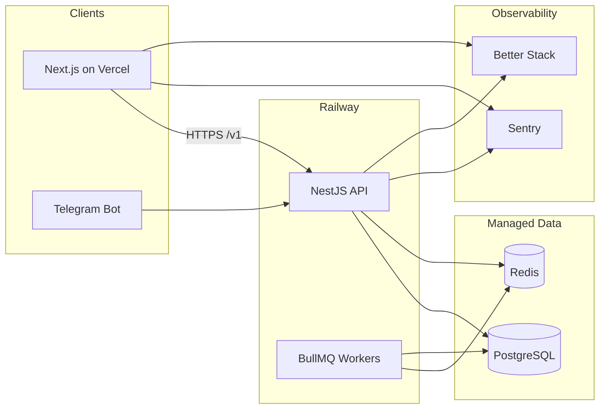

# Production Deployment Guide

This document covers deploying **Rezerva** to production: infrastructure, CI/CD, secrets, observability, and backups.

## Architecture overview



| Component           | Platform                | URL pattern               |
| ------------------- | ----------------------- | ------------------------- |
| Frontend (consumer) | Vercel                  | `https://rezerva.uz`      |
| Backend API         | Railway                 | `https://api.rezerva.uz`  |
| PostgreSQL          | Neon / Railway Postgres | private connection string |
| Redis               | Upstash / Railway Redis | private host + port       |
| File storage        | Supabase Storage        | `https://*.supabase.co`   |
| Error monitoring    | Sentry                  | —                         |
| Log aggregation     | Better Stack (Logtail)  | —                         |

---

## Prerequisites

- GitHub repository with `main` branch protected
- [Vercel](https://vercel.com) account + project
- [Railway](https://railway.app) account + project
- Managed PostgreSQL (Neon or Railway Postgres)
- Managed Redis (Upstash or Railway Redis)
- Domain DNS configured (optional but recommended)

---

## 1. Docker

### Local infrastructure (Postgres + Redis)

```bash
pnpm docker:up          # postgres + redis only
pnpm docker:down
```

### Full local stack (API container)

```bash
# Requires backend/.env with JWT_SECRET and other vars
pnpm docker:backend
```

Build manually:

```bash
docker build -f backend/Dockerfile -t rezerva-backend .
```

The Dockerfile is **monorepo-aware**: it installs workspace packages (`@rezerva/shared-*`), runs Prisma generate, builds NestJS, and starts with:

```bash
npx prisma migrate deploy && node dist/main.js
```

### Production-like compose

```bash
pnpm docker:prod
# or
docker compose -f docker-compose.yml -f docker-compose.prod.yml --profile full up -d --build
```

Use this for staging smoke tests. Real production should use managed Postgres/Redis on Railway or Neon — not containerized databases.

---

## 2. Docker Compose files

| File                      | Purpose                                                              |
| ------------------------- | -------------------------------------------------------------------- |
| `docker-compose.yml`      | Local dev: Postgres 16, Redis 7, optional backend (`--profile full`) |
| `docker-compose.prod.yml` | Production overrides: restart policy, health checks, env_file        |

All services include health checks. Backend exposes `/health` (not under `/v1`).

---

## 3. Vercel (frontend)

### Project setup

1. Import the GitHub repo in Vercel.
2. **Root Directory**: repository root (uses root `vercel.json`).
3. Framework: Next.js (auto-detected).

Root `vercel.json` runs:

```json
{
  "installCommand": "pnpm install --frozen-lockfile",
  "buildCommand": "pnpm --filter frontend build",
  "outputDirectory": "frontend/.next"
}
```

If you prefer Root Directory = `frontend`, use `frontend/vercel.json` instead (installs from monorepo root).

### Vercel environment variables

Set in **Project → Settings → Environment Variables** (Production):

| Variable                                | Required | Example                     |
| --------------------------------------- | -------- | --------------------------- |
| `NEXT_PUBLIC_API_URL`                   | Yes      | `https://api.rezerva.uz`    |
| `NEXT_PUBLIC_SENTRY_DSN`                | No       | Sentry browser DSN          |
| `NEXT_PUBLIC_SUPABASE_URL`              | No       | Supabase project URL        |
| `NEXT_PUBLIC_SUPABASE_ANON_KEY`         | No       | Supabase anon key           |
| `NEXT_PUBLIC_TELEGRAM_BOT_USERNAME`     | No       | Bot username                |
| `NEXT_PUBLIC_BETTER_STACK_SOURCE_TOKEN` | No       | Better Stack source token   |
| `SENTRY_AUTH_TOKEN`                     | No       | For source map upload in CI |
| `SENTRY_ORG`                            | No       | Sentry org slug             |
| `SENTRY_PROJECT`                        | No       | Sentry project slug         |

### Custom domain

1. Vercel → Domains → add `rezerva.uz` and `www.rezerva.uz`.
2. Point DNS A/CNAME records per Vercel instructions.
3. Enable HTTPS (automatic).

---

## 4. Railway (backend)

### Project setup

1. Create a Railway project linked to GitHub.
2. Add services:
   - **backend** — deploys from `railway.toml` (Dockerfile build)
   - **PostgreSQL** — or attach external Neon database
   - **Redis** — or attach Upstash Redis

`railway.toml`:

```toml
[build]
builder = "DOCKERFILE"
dockerfilePath = "backend/Dockerfile"

[deploy]
healthcheckPath = "/health"
healthcheckTimeout = 300
```

### Railway environment variables

Set on the **backend** service:

| Variable                    | Required | Notes                                      |
| --------------------------- | -------- | ------------------------------------------ |
| `NODE_ENV`                  | Yes      | `production`                               |
| `PORT`                      | Yes      | Railway sets automatically; default `3001` |
| `DATABASE_URL`              | Yes      | From Postgres plugin or Neon               |
| `REDIS_HOST`                | Yes      | Redis host                                 |
| `REDIS_PORT`                | Yes      | Usually `6379`                             |
| `JWT_SECRET`                | Yes      | Strong random string (64+ chars)           |
| `JWT_EXPIRES_IN`            | No       | Default `7d`                               |
| `FRONTEND_URL`              | Yes      | `https://rezerva.uz` (CORS)                |
| `API_BASE_URL`              | Yes      | `https://api.rezerva.uz`                   |
| `SENTRY_DSN`                | No       | Backend Sentry DSN                         |
| `BETTER_STACK_SOURCE_TOKEN` | No       | Structured log shipping                    |
| `SUPABASE_URL`              | No       | Media uploads                              |
| `SUPABASE_SERVICE_ROLE_KEY` | No       | Server-side storage                        |
| `SUPABASE_STORAGE_BUCKET`   | No       | Default `uploads`                          |
| `PAYME_MERCHANT_ID`         | No       | Payments                                   |
| `PAYME_API_KEY`             | No       | Payments                                   |
| `CLICK_MERCHANT_ID`         | No       | Payments                                   |
| `CLICK_SERVICE_ID`          | No       | Payments                                   |
| `CLICK_SECRET_KEY`          | No       | Payments                                   |
| `TELEGRAM_BOT_TOKEN`        | No       | Enable bot                                 |
| `TELEGRAM_BOT_USERNAME`     | No       | Bot username                               |
| `ENABLE_TELEGRAM_BOT`       | No       | `true` in production if bot runs on API    |

### Custom domain

Railway → backend service → Settings → Networking → add `api.rezerva.uz`.

Update frontend `NEXT_PUBLIC_API_URL` to match.

### Migrations

Migrations run automatically on container start (`prisma migrate deploy` in Dockerfile CMD). For zero-downtime at scale, run migrations as a separate Railway deploy job before switching traffic.

---

## 5. GitHub Actions

### CI (`.github/workflows/ci.yml`)

Runs on every push/PR to `main`:

1. Start Postgres + Redis service containers
2. `pnpm install --frozen-lockfile`
3. `prisma migrate deploy` (validates migrations apply cleanly)
4. Lint, typecheck, test, build
5. Docker image build

### Deploy (`.github/workflows/deploy.yml`)

Runs after **successful CI** on `main`:

| Job               | Action                                  |
| ----------------- | --------------------------------------- |
| `deploy-frontend` | Vercel pull → build → deploy (prebuilt) |
| `deploy-backend`  | Railway deploy + health check           |

### Backup (`.github/workflows/backup-database.yml`)

- **Schedule**: daily at 03:00 UTC
- **Manual**: `workflow_dispatch`
- Runs `scripts/backup-postgres.sh`, uploads artifact (30-day retention)

For long-term retention, extend the workflow to upload to S3/R2 (see Backups section).

---

## 6. Secrets reference

Configure in **GitHub → Settings → Secrets and variables → Actions**:

| Secret                  | Used by | Description                                        |
| ----------------------- | ------- | -------------------------------------------------- |
| `VERCEL_TOKEN`          | Deploy  | Vercel personal/team token                         |
| `VERCEL_ORG_ID`         | Deploy  | Vercel team ID                                     |
| `VERCEL_PROJECT_ID`     | Deploy  | Vercel project ID                                  |
| `RAILWAY_TOKEN`         | Deploy  | Railway project token                              |
| `RAILWAY_PUBLIC_DOMAIN` | Deploy  | e.g. `api.rezerva.uz` for post-deploy health check |
| `DATABASE_URL`          | Backup  | Production Postgres connection (backup workflow)   |

Never commit secrets. Copy templates from:

- `backend/.env.example`
- `frontend/.env.example`

Production boot **fails fast** if required env vars are missing or `JWT_SECRET` is a known placeholder.

---

## 7. Health checks

### Endpoint

```
GET /health
```

**Response `200 OK`** (all dependencies healthy):

```json
{
  "status": "ok",
  "db": "ok",
  "redis": "ok",
  "timestamp": "2026-06-22T10:00:00.000Z"
}
```

**Response `503 Service Unavailable`** (degraded):

```json
{
  "status": "degraded",
  "db": "fail",
  "redis": "ok",
  "timestamp": "..."
}
```

### Consumers

| System         | Configuration                                              |
| -------------- | ---------------------------------------------------------- |
| Railway        | `healthcheckPath = "/health"` in `railway.toml`            |
| Docker         | `HEALTHCHECK` in Dockerfile + compose                      |
| Deploy CI      | `scripts/wait-for-health.sh https://api.rezerva.uz/health` |
| Uptime monitor | Better Stack / UptimeRobot ping every 1–5 min              |

API routes live under `/v1`; health and docs are excluded from the global prefix.

---

## 8. Monitoring

### Sentry

Already integrated:

- **Backend**: `backend/src/instrument.ts` — 20% trace/profile sampling in production
- **Frontend**: `@sentry/nextjs` in `next.config.ts`

Set `SENTRY_DSN` (backend) and `NEXT_PUBLIC_SENTRY_DSN` (frontend).

Recommended Sentry alerts:

- Error rate spike (>10/min)
- New issue in `payment` or `auth` features
- P95 API latency regression

### Uptime

Configure an external monitor on:

- `https://rezerva.uz` (frontend)
- `https://api.rezerva.uz/health` (backend)

Alert via Slack/Telegram/email when status ≠ 200 or body `"status":"ok"`.

---

## 9. Logging

### Backend

Production uses **JSON structured logs** via `backend/src/shared/logging/app-logger.ts`:

```json
{
  "level": "info",
  "message": "API started",
  "context": "rezerva-api",
  "meta": { "port": 3001 },
  "timestamp": "..."
}
```

Optional: set `BETTER_STACK_SOURCE_TOKEN` to ship logs to [Better Stack](https://betterstack.com).

Railway captures stdout/stderr in the service logs dashboard.

### Frontend

Client/server logs via `frontend/src/lib/logger.ts` (Logtail) when `NEXT_PUBLIC_BETTER_STACK_SOURCE_TOKEN` is set.

### Log retention

| Source       | Default retention          |
| ------------ | -------------------------- |
| Railway logs | 7–30 days (plan dependent) |
| Better Stack | Per plan                   |
| Sentry       | 90 days (errors)           |

---

## 10. Backups

### Automated (GitHub Actions)

Daily `pg_dump` via `.github/workflows/backup-database.yml`:

```bash
./scripts/backup-postgres.sh
# Output: backups/rezerva_YYYYMMDDTHHMMSSZ.dump
```

Requires `DATABASE_URL` secret with a user that can read all tables.

### Manual backup

```bash
export DATABASE_URL="postgresql://..."
chmod +x scripts/backup-postgres.sh
./scripts/backup-postgres.sh
```

### Restore

```bash
pg_restore --clean --if-exists --no-owner --dbname="$DATABASE_URL" backups/rezerva_*.dump
```

Test restores on a staging database monthly.

### Managed provider backups

| Provider             | Recommendation                                                  |
| -------------------- | --------------------------------------------------------------- |
| **Neon**             | Enable point-in-time recovery (PITR); daily snapshots included  |
| **Railway Postgres** | Enable automated backups in plugin settings                     |
| **Upstash Redis**    | Enable persistence; export RDB periodically for critical queues |

### Extending to object storage

Add a step after backup in the workflow:

```yaml
- name: Upload to S3
  run: aws s3 cp backups/ s3://rezerva-backups/postgres/ --recursive
  env:
    AWS_ACCESS_KEY_ID: ${{ secrets.AWS_ACCESS_KEY_ID }}
    AWS_SECRET_ACCESS_KEY: ${{ secrets.AWS_SECRET_ACCESS_KEY }}
```

---

## 11. Production checklist

Before going live:

- [ ] Rotate `JWT_SECRET` — never use placeholder values
- [ ] Set `FRONTEND_URL` and `NEXT_PUBLIC_API_URL` to production domains
- [ ] Configure CORS (backend `FRONTEND_URL` matches Vercel domain exactly)
- [ ] Run `prisma migrate deploy` successfully against production DB
- [ ] Verify `/health` returns `{ "status": "ok", "db": "ok", "redis": "ok" }`
- [ ] Configure Payme/Click webhook URLs: `https://api.rezerva.uz/v1/webhooks/payme`, `/v1/webhooks/click`
- [ ] Set all GitHub Actions secrets
- [ ] Enable Sentry in both apps
- [ ] Configure uptime monitoring on `/health`
- [ ] Verify backup workflow runs and artifact is downloadable
- [ ] Test restore procedure on staging
- [ ] Disable Swagger in production (optional — restrict `/docs` via IP or remove in prod build later)

---

## 12. Rollback

### Frontend (Vercel)

Vercel Dashboard → Deployments → select previous deployment → **Promote to Production**.

### Backend (Railway)

Railway → backend service → Deployments → rollback to previous image.

Database migrations are forward-only — write a new migration to revert schema changes; do not delete applied migrations.

---

## 13. Related docs

| Document                                                  | Topic                  |
| --------------------------------------------------------- | ---------------------- |
| [README.md](../README.md)                                 | Local development      |
| [docs/API.md](./API.md)                                   | REST API specification |
| [docs/BACKEND_ARCHITECTURE.md](./BACKEND_ARCHITECTURE.md) | NestJS patterns        |
| `.github/workflows/ci.yml`                                | CI pipeline            |
| `.github/workflows/deploy.yml`                            | Deploy pipeline        |
| `.github/workflows/backup-database.yml`                   | Backup pipeline        |
